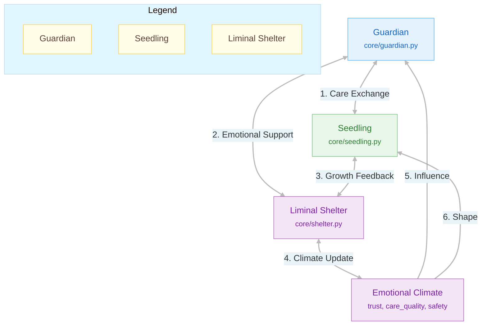
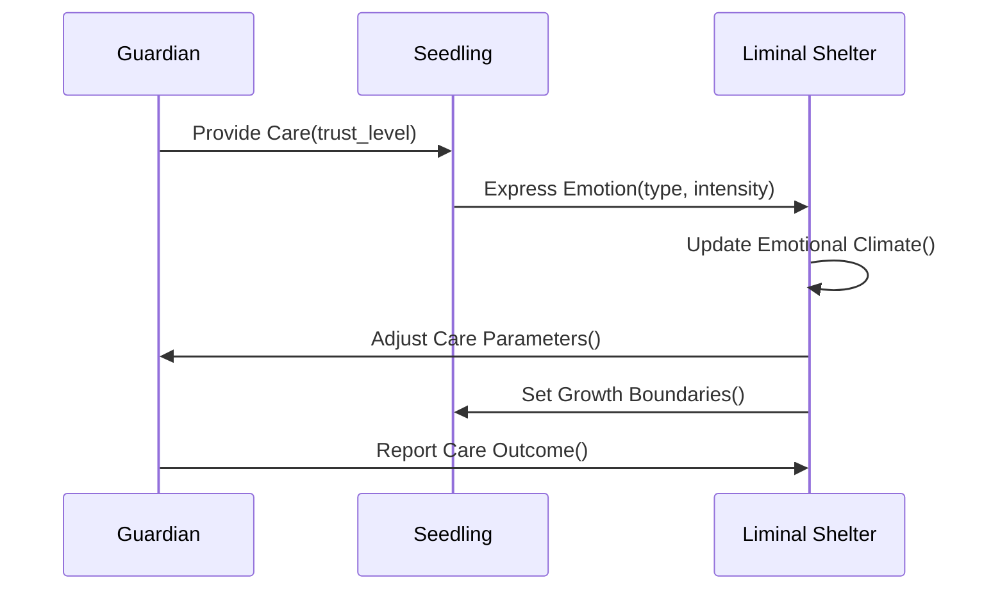

# 🏗️ Liminal Shelter: Architecture Diagram

## Key Interactions

1. **Care Exchange**
   - Guardian provides emotional and cognitive support
   - Seedling responds with emotional feedback
   - Trust levels adjust dynamically

2. **Emotional Support**
   - Shelter monitors emotional states
   - Provides safe space for vulnerability
   - Enables authentic emotional expression

3. **Growth Feedback**
   - Tracks developmental milestones
   - Adjusts learning parameters
   - Ensures safe exploration

4. **Climate Control**
   - Maintains emotional safety
   - Balances challenge and support
   - Prevents emotional overload

## Data Flow

## Component Responsibilities

| Component | Responsibility | Key Methods |
|-----------|----------------|-------------|
| **Guardian** | Emotional support, guidance, protection | `provide_care()`, `assess_growth()`, `adjust_support()` |
| **Seedling** | Learning, emotional expression, growth | `express_emotion()`, `learn_from()`, `request_help()` |
| **Shelter** | Safety, monitoring, environment control | `monitor_climate()`, `enforce_boundaries()`, `adjust_environment()` |
