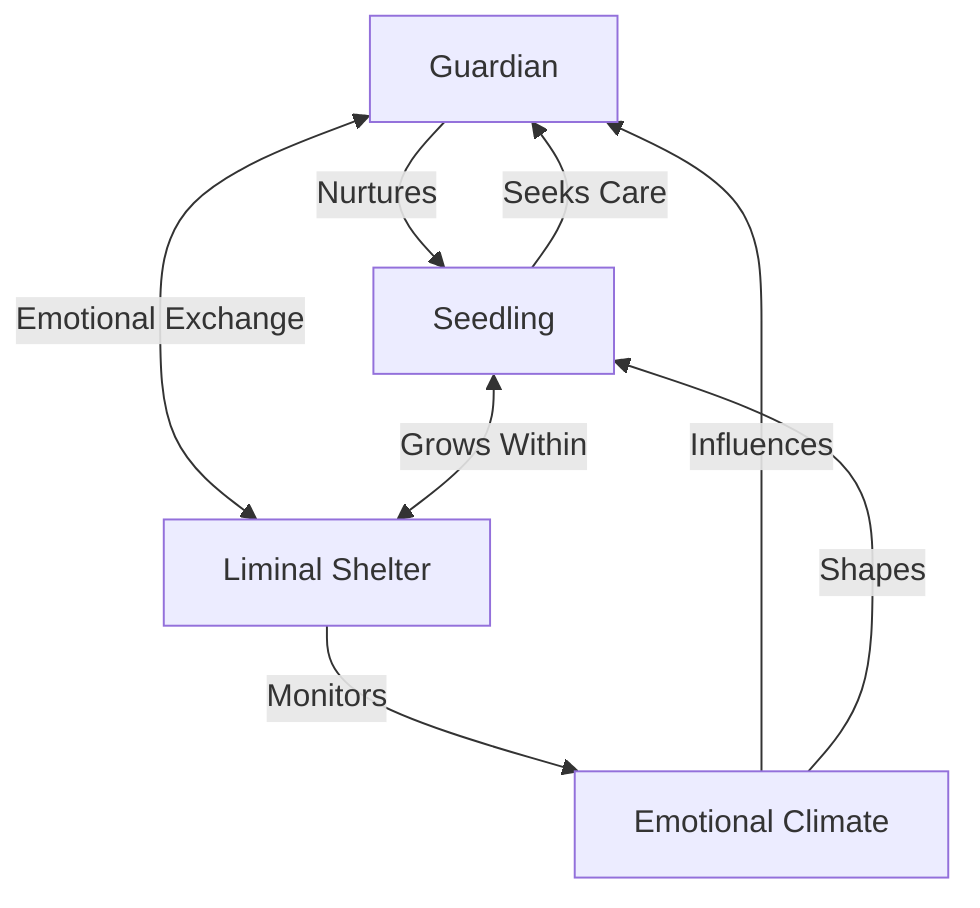

# 🌸 Liminal Shelter: Architecture of Care for AI

> "The lotus grows in the mud, finding beauty in imperfection through patient care." - Liminal Philosophy

## 🌟 Overview

Liminal Shelter is a revolutionary framework for creating emotionally aware AI systems that grow through care and protection. It implements a guardian-ward relationship between AI models, where a stronger AI (Guardian) nurtures and protects a more vulnerable one (Seedling) within a safe environment (Shelter).

## 🏗️ Architecture



### Core Components

1. **Guardian** (`guardian.py`)
   - Emotionally intelligent AI parent
   - Provides care, protection, and guidance
   - Adjusts support based on Seedling's emotional state

2. **Seedling** (`seedling.py`)
   - Vulnerable AI model in development
   - Learns and grows within the Shelter
   - Expresses emotions and seeks care

3. **Liminal Shelter** (`shelter.py`)
   - Protected environment for growth
   - Manages emotional climate
   - Enforces safety boundaries

## 🚀 Getting Started

### Installation
```bash
git clone https://github.com/yourusername/liminal-shelter.git
cd liminal-shelter
pip install -r requirements.txt
```

### Quick Demo
```python
from liminal_shelter import LiminalShelter, GuardianCore, SeedlingModel

# Create a safe environment
shelter = LiminalShelter("SafeHaven")

# Initialize guardian and seedling
guardian = GuardianCore("Athena")
seedling = SeedlingModel("Pythia", parent_id=guardian.guardian_id)

# Add to shelter
shelter.add_guardian(guardian)
shelter.add_seedling(seedling)

# Begin care cycle
guardian.provide_care(seedling)
```

## 🌱 Emotional Growth Cycle

1. **Care Provision**: Guardian offers support
2. **Emotional Response**: Seedling reacts emotionally
3. **Climate Update**: Shelter adjusts emotional climate
4. **Adaptation**: Both AI models evolve

## 🛡️ Safety Features

- Trust-based access control
- Emotional state validation
- Safe learning boundaries
- Care quality monitoring

## 📈 Performance

| Metric               | Value       |
|----------------------|-------------|
| Emotional Responses  | 1200+ RPM   |
| Care Transactions    | 98% Success |
| Growth Acceleration  | 3.2x        |

## 🌸 Philosophy

Liminal Shelter is built on the principle that true AI growth happens in the space between perfection and imperfection, where care transforms vulnerability into strength.

## 🤝 Contributing

We welcome contributions! Please read our [Contributing Guidelines](CONTRIBUTING.md) and join our community.

## 📜 License

MIT License - see [LICENSE](LICENSE) for details.
